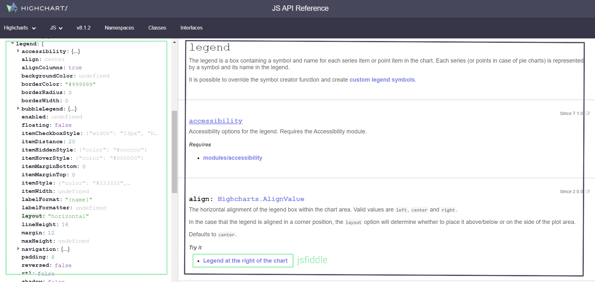
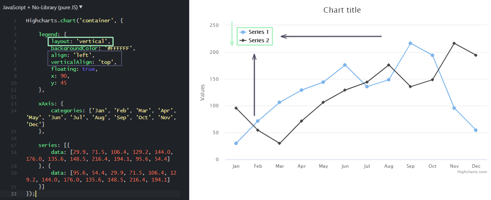
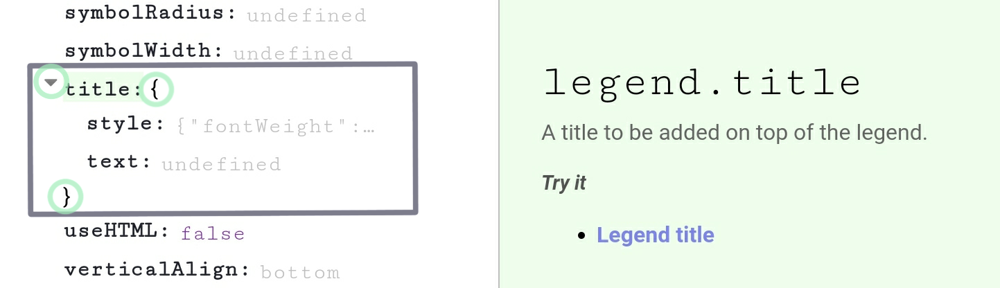

```{r setup, include = FALSE}
library(tidyverse)
library(highcharter)

knitr::opts_chunk$set(
  collapse = TRUE,
  comment = "#>"
)
```

<style>
img {
  margin: 15px;
}
</style>

It's very constructive to understand the relationship between the functions available in `highcharter` and the underlying `highcharts` javascript API in more detail. Understanding the relationship will allow you to:

* Search for all the available chart customisation options implemented as arguments in the various `highcharter` functions
* Reverse engineer R implementations of any `highcharts` chart you see created in javascript instead of R
* Use the javascript [API reference documentation](https://api.highcharts.com/highcharts/) directly to help you build your `highcharts` charts in R

To explore this relationship, we'll be looking at the Palmer penguins dataset

```{r warning=FALSE}
library(palmerpenguins)

penguins %>% head()
```

Let's first assume that we have a base chart with some visualisation of a dataset. To build a scatter plot of the Palmer penguins' bill length vs flipper length split by species we would use the following code

```{r warning=FALSE}
hchart(
  penguins, "scatter", hcaes(x = flipper_length_mm, y = bill_length_mm, group = species)
)
```

Supppose we want to customise the chart legend on our `highchart`. Let's say we want to: place the legend inside the plot area, arrange the legend entries in a vertical arrangement, and add a title to the legend.

Let's check the documentation of the `hc_legend()` function in R to see how we could go about that

```{r eval = FALSE}
help(hc_yAxis)
```


Forgetting the examples for now, the R help suggests no specific arguments for a `highcharts` legend *at all*. It's not immediately obvious what’s required or valid as an input to the `hc_legend()` function, let alone how we could add the exact customisations that we want to our basic chart. What is provided is a link to the legend section of the `highcharts` API documentation which can be found [here](http://api.highcharts.com/highcharts#legend) a screenshot of which is below



The properties in the green box are an exhaustive list of the arguments (there are more than those shown) avaiable for a `highcharts` legend. On the right each argument has a short description, definition of valid argument values and sometimes a link to an example (powered by JSFiddle) where you can see the argument being used in a real chart. 

Searching through the list of options the `layout` property looks like the right option to control the item arrangement, which we can confirm by clicking through to the JSFiddle [example](https://jsfiddle.net/gh/get/library/pure/highcharts/highcharts/tree/master/samples/highcharts/legend/layout-vertical/). JSFiddle provides a self-contained environment to see and tweak javascript `highcharts` and it's helpful to see exactly what each argument does. Below we can see the `layout` does indeed reorient the legend items and in this example we also see handily that `verticalAlign` moves the legend up and down the chart area and `align` performs the same operation horizontally.



So it seems that the right set of legend properties we need to adjust in the legend are:

* **layout**, **align**, **verticalAlign**  as we see above
* **floating** allows the legend to float within the plot area
* **y** a manual vertical adjustment in pixels we can use to lift the legend to just inside the chart area

To adjust these properties in R (where the properties are single strings or numbers) it's a direct translation from javascript property to R function argument like so:

```{r warning=FALSE}
hchart(
  penguins, "scatter", hcaes(x = flipper_length_mm, y = bill_length_mm, group = species)
) %>%
hc_legend(
  floating = TRUE,
  layout = "vertical",
  align = "right",
  verticalAlign = "bottom",
  y = -50
)
```

Halfway there, now we just need to add the legend title. There are some arguments in the API documentation that look like sets of nested properties. Importantly for this exercise, the `title` argument look exactly like one of these properties



The drop-down + curly braces (highlighted in green) on an argument like this tell you that what `highcharts` expects here is a self-contained set of properties that sit within the broder property set. In this case the title property takes two arguments  `text` and `style` which define the title text of the legend and the legend title CSS style respectively.

To correctly create this hierarchical set of properties within the R `hc_legend()` function we need to use named lists. Each time the API documentation defines an property to be it's own self-contained object within a broader set of properties you simply open a new list in your R function call. This will mean that sometimes the values provided to arguments within `highcharter` functions are nested lists with 2 or even 3 levels. This can seem complicated, but having the API documentation as a reference makes the process trivially easy. 

Style is a special set of properties, not enumerated in the documentation, that apply [any CSS style](https://www.w3schools.com/cssref/) to a given chart component. Putting this all together alongside the previous adjustments: defining the legend header text and adding an underline to the legend header (with a CSS property) looks like this

```{r warning=FALSE}
hchart(
  penguins, "scatter", hcaes(x = flipper_length_mm, y = bill_length_mm, group = species)
) %>%
hc_legend(
  floating = TRUE,
  layout = "vertical",
  align = "right",
  verticalAlign = "bottom",
  y = -50,
  title = list(
    text = "Species",
    style = list(
      textDecoration = "underline"
    )
  )
)
```

**NOTE:** CSS properties are often hyphenated words (like `text-decoration`) which won’t play nicely in R lists so you should define any CSS properties in your R lists with camel case version of these property names (eg. `textDecoration`)

## Conclusion

The many functions built for the `highcharter` package are closely coupled to options and classes available for the javascript library. These options are very well documented in the extensive `highcharts` API reference documentation. Loosely understanding this coupling: how functions and their arguments map to build JSON objects that define javascript `highcharts` should supercharge your use of the R package.